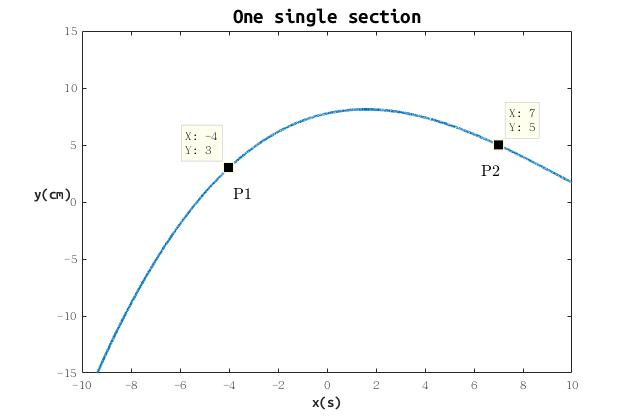
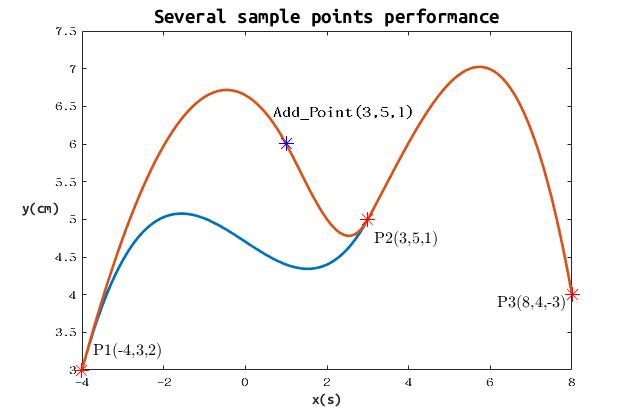

# Interpolation_math

A new interpolation algorithm, which can customize the displacement and velocity of each sample point.

## Prerequisites

These tools depend on Eigen modules (mainly Dense) and C++ Standard Library. You'd better install Eigen3 in advance.

#### For linux

`sudo apt-get install libeigen3-dev`

#### For Mac

`brew install eigen`

The namespace can be changed if necessary.

---
## Test

In `./test` folder provides a test sample to test the fundamental functions, you have to do:

```
mkdir build 
cd build 
cmake .. 
make 
./three_try
```
Now you can see the output, and see below instructions to understand what `./test/there_try.cpp` is doing.
## Functions

In ThreeInterpolation folder, the source file **ThreeInterpolation.cpp** and header file **ThreeInterpolation.h** declare and define the **ThreeInterpolation** class. Specific annotations are in code, temporarily only Chinese explaination contained.

#### ThreeInterpolation /~ThreeInterpolation

 There are two overrided conductor functions in this class. Copy conductor and destructor are default.

#### EvalHere

Get the value of the derived piecewise three degress polynomial function at one particular point x_0.

#### CalculatePoints

Calculate the value of the derived piecewise three degress polynomial function at an arithmetic progression with common difference of t_0.

#### GetPoints

Return the the value of the derived piecewise three degress polynomial function at an arithmetic progression with common difference of t0 after CalculatePoints.

#### GetTimes

Return the arithmetic progression with common difference of t_0.

#### AddPoint

Add a sample point with its horizontal coordinates x_a, vertical coordinates y_a and slope s_a into this ThreeInterpolation object.

#### GetCoef

Get piece_num<sup>th</sup> section of three degree polynomial's coefficients.

---

## Performance

#### Two sample points (x , y , slope)

This figure can be derived by running the matlab script.

P1 :    (-4 , 3 , 2)

P2 :    (7 , 5 , -1)




#### Several sample points (x , y , slope)

The data is derived from C++ code and plot by matlab script.




